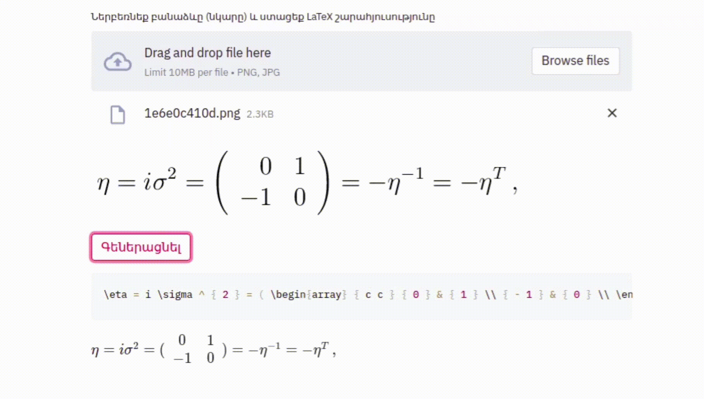
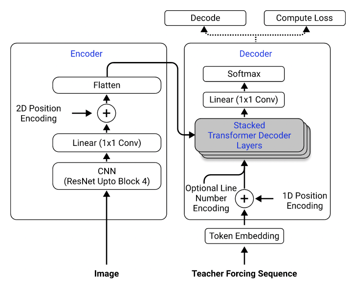
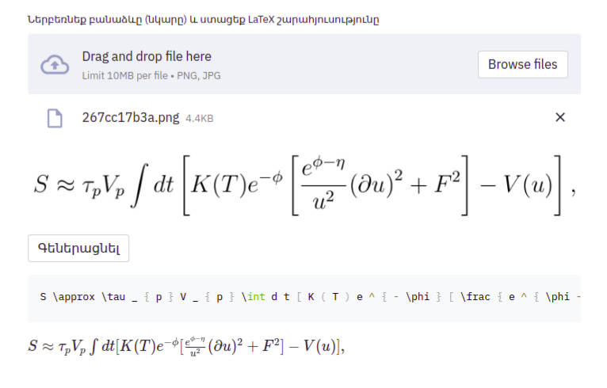
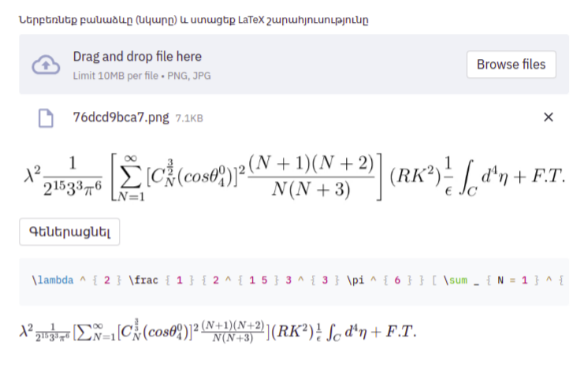
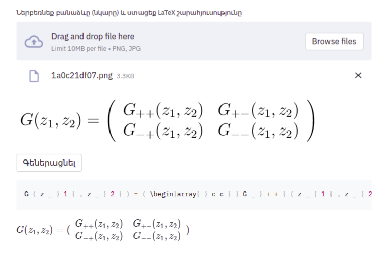
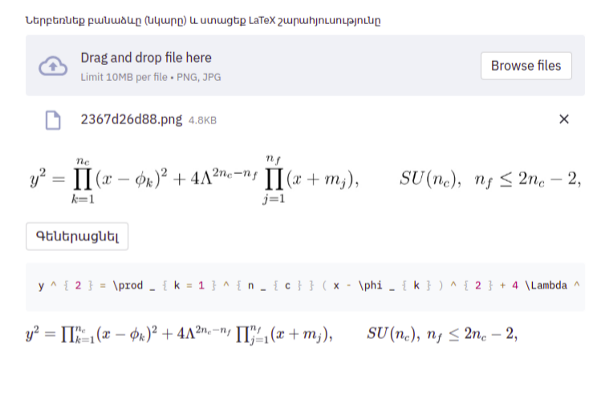

# Image-to-LaTeX


An application that maps an image of a LaTeX math equation to LaTeX code.

<p align="center"></p>

## Introduction

The problem of image-to-markup generation was attempted by [Deng et al. (2016)](https://arxiv.org/pdf/1609.04938v1.pdf). They extracted about 100K formulas by parsing LaTeX sources of papers from the arXiv. They rendered the formulas using pdflatex and converted the rendered PDF files to PNG format. The raw and preprocessed versions of their dataset are available [online](http://lstm.seas.harvard.edu/latex/data/). In their model, a CNN is first used to extract image features. The rows of the features are then encoded using a RNN. Finally, the encoded features are used by an RNN decoder with an attention mechanism. The model has 9.48 million parameters in total. Recently, Transformer has overtaken RNN for many language tasks, so I thought I might give it try in this problem.

## Methods

Using their dataset, I trained a model that uses ResNet-18 as encoder with 2D positional encoding and a Transformer as decoder with cross-entropy loss. (Similar to the one described in [Singh et al. (2021)](https://arxiv.org/pdf/2103.06450.pdf), except that I used ResNet only up to block 3 to reduce computational costs, and I excluded the line number encoding as it doesn't apply to this problem.) The model has about 3 million parameters.

<p align="center"></p>

<small>Model architecture. Taken from Singh et al. (2021).</small>

Initially, I used the preprocessed dataset to train my model, because the preprocessed images are downsampled to half of their original sizes for efficiency, and are grouped and padded into similar sizes to facilitate batching. However, this rigid preprocessing turned out to be a huge limitation. Although the model could achieve a reasonable performance on the test set (which was preprocessed the same way as the training set), it did not generalize well to images outside the dataset, most likely because the image quality, padding, and font size are so different from the images in the dataset. This phenomenon has also been observed by others who have attempted the same problem using the same dataset (e.g., [this project](https://wandb.ai/site/articles/image-to-latex), [this issue](https://github.com/harvardnlp/im2markup/issues/12) and [this issue](https://github.com/harvardnlp/im2markup/issues/21)).

To this end, I used the raw dataset and included image augmentation (e.g. random scaling, gaussian noise) in my data processing pipeline to increase the diversity of the samples. Moreover, unlike Deng et al. (2016), I did not group images by size. Rather, I sampled them uniformly and padded them to the size of the largest image in the batch, so that the model must learn how to adapt to different padding sizes.

Additional problems that I faced in the dataset:
- Some latex code produces visually identical outputs (e.g. `\left(` and `\right)` look the same as `(` and `)`), so I normalized them.
- Some latex code is used to add space (e.g. `\vspace{2px}` and `\hspace{0.3mm}`). However, the length of the space is diffcult to judge even for humans. Also, there are many ways to express the same spacing (e.g. 1 cm = 10 mm). Finally, I don't want the model to generate code on blank images, so I removed them. (I only removed `\vspace` and `\hspace`, but turns out there are a lot of commands for horizontal spacing. I only realized that during error analysis. See below.)

## Results

The [best run]( https://drive.google.com/file/d/1DOU13cBWbybExJIQSWA6jV7N6Q5Oqgw0/view?usp=sharing)
Here is an example from the test dataset:

<p align="center">

<p align="center">
</p>

## How To Use

### Setup

Clone the repository to your computer and position your command line inside the repository folder:

```
git clone https://github.com/kingyiusuen/image-to-latex.git
cd image-to-latex
```

Then, create a virtual environment named `venv` and install required packages:

```
make venv
make install-dev
```

### Data Preprocessing

Run the following command to download the im2latex-100k dataset and do all the preprocessing. (The image cropping step may take over an hour.)

```
python scripts/prepare_data.py
```

### Model Training and Experiment Tracking

#### Model Training

An example command to start a training session:

```
python scripts/run_experiment.py trainer.gpus=1 data.batch_size=32
```

Configurations can be modified in `conf/config.yaml` or in command line. See [Hydra's documentation](https://hydra.cc/docs/intro) to learn more.

#### Experiment Tracking using Weights & Biases

The best model checkpoint will be uploaded to Weights & Biases (W&B) automatically (you will be asked to register or login to W&B before the training starts). Here is an example command to download a trained model checkpoint from W&B:

```
python scripts/download_checkpoint.py RUN_PATH
```

Replace RUN_PATH with the path of your run. The run path should be in the format of `<entity>/<project>/<run_id>`. To find the run path for a particular experiment run, go to the Overview tab in the dashboard.

For example, you can use the following command to download my best run

```
python scripts/download_checkpoint.py kingyiusuen/image-to-latex/1w1abmg1
```

The checkpoint will be downloaded to a folder named `artifacts` under the project directory.

### Testing and Continuous Integration

The following tools are used to lint the codebase:

`isort`: Sorts and formats import statements in Python scripts.

`black`: A code formatter that adheres to PEP8.

`flake8`: A code linter that reports stylistic problems in Python scripts.

`mypy`: Performs static type checking in Python scripts.

Use the following command to run all the checkers and formatters:

```
make lint
```

See `pyproject.toml` and `setup.cfg` at the root directory for their configurations.

Similar checks are done automatically by the pre-commit framework when a commit is made. Check out `.pre-commit-config.yaml` for the configurations.

### Deployment

An API is created to make predictions using the trained model. Use the following command to get the server up and running:

```
make api
```

You can explore the API via the generated documentation at http://0.0.0.0:8000/docs.

To run the Streamlit app, create a new terminal window and use the following command:

```
make streamlit
```

The app should be opened in your browser automatically. You can also open it by visiting [http://localhost:8501](http://localhost:8501). For the app to work, you need to download the artifacts of an experiment run (see above) and have the API up and running.

To create a Docker image for the API:

```
make docker

```
I think I should have defined the scope of the project better:

- Do I want the model to tell the difference between regular-sized and large parentheses (e.g. `(`, `\big(`, `\Big(`, `\bigg(`, `\Bigg(`)?
- Do I want the model to recognize horizontal and vertical spacing? (There are [over 40 commands for horizontal spacing](https://tex.stackexchange.com/a/74354).)
- Do I want to the model to recognize different font styles? (Here is [a list of available font style in LaTex](https://tex.stackexchange.com/a/58124).)
- etc.

These questions should be used to guide the data cleaning process.

- The model performacne is not as good as I want to be, but I hope the lessons I learned from this project are useful to someone wants to tackle similar problems in the future.

## Հայերեն

Բազմաթիվ փորձերից ու նախագծումներից հետո երեկ վերջապես ստացա արհեստական բանականության՝ սիմվոլների օպտիկական ճանաչման (OCR) ինքնուրույն համակարգ, որը մաթեմատիկական բանաձևերի՝ նկարների հիման վրա ստանում է LaTeX շարահյուսություն։

Ով հավես չունի կարդալու 😁

Վերջին լուրջ արդյունք ցուցաբերած մոդելը կարելի է ներբեռնել այստեղից՝ https://drive.google.com/file/d/1DOU13cBWbybExJIQSWA6jV7N6Q5Oqgw0/view?usp=sharing

## Աշխատանքի սկզբունքը

Աշխատանքը կատարվել է Հարվարդի հետազոտություններից մեկի հիման վրա։

Նեյրոնային ցանցը աշխատում է Encoder Decoder սկզբունքով։ Օգտագործելով ResNet-18-ը՝ 2D դիրքային կոդավորման համար, իսկ որպես դեկոդավորող Transformer-ը cross-entropy loss հիմքով։ Այս մեթոդը մանրամասն նկարագրված է այս հոդվածում՝
https://arxiv.org/pdf/2103.06450.pdf 

Ի տարբերություն նկարագրված տարբերակի՝ ես RestNet-ը օգտագործել եմ միայն երրորդ բլոկի համար հաշվարկային ծավալը նվազեցնելու նպատակով։

- Մոդելն ունի մոտ երեք միլիոն պարամետր։

Վերոնշյալ հոդվածում կային մի քանի առանցքային խնդիրներ՝ կապված տվյալների մշակման հետ։
Ի սկզբանե ես էլ փորձեցի օգտագործել նախապես մշակված տվյալների հավաքածու։
Բանն այն է, որ նկարները էֆեկտիվության բարձրացման նպատակով սուբդիսկրետիզացվում են մինչև նրանց իրական չափերի կեսը, այնուհետև խմբավորվում են ըստ չափերի ու լրացվում մինչև բոլոր նկարները միմյանց համապատասխանեն, դա էլ արվում է պակետների մշակման պրոցեսը հեշտացնելու նպատակով։
Սակայն նման կոպիտ մշակումը բավականին լուրջ սահմանափակում է մոդելի ադապտիվությունը։

Քանի որ այն տվյալների հավաքածուն, որի հիման վրա «սովորել» է նեյրոցանցը նմանատիպ է, այսինքն նույն չափի, տառատեսակի ու տառաչափի նկարներ են, այլ տիպի նկարների ճանաչման հարցում ընթացիք մոդելը ունեցավ բավականին լուրջ խնդիրներ։

## Ինչ փոփոխություններ են արվել 

Օգտագործվել է նախապես չմշակված և չսորտավորված տվյալների (նկարների) հավաքածու։
Ընտրության բազմազանություն ապահովելու համար կազմակերպվել է նկարների պատահական մասշտաբայնություն ու որոշ դեպքերում կիրառվել է գաուսյան աղմուկ։
Ինչպես նաև նկարները չեն խմբավորվել ըստ հստակ սահմանված չափի, այլ հավասարաչափ դասավորվել են ըստ հավաքածուի մեջ եղած ամենամեծ նկարի։
Այս ամենը արվել է վերջնական մոդելի ադապտիվության բարձրացման համար։

Վերոնշյալ հիմնական փոփոխություններից բացի կատարվել են լրացուցիչ քայլեր, որոշ սկզբունքային լրացումներ մոդելի աշխատանքի օպտիմալացման համար։

▫️Ում հետաքրիր է՝ ավանդական...տամք ձեզ պատասխանի ի գիրս մասնավորս 💬

- Տարբեր տվյալների հավաքածուները հասանելի են այստեղ՝ http://lstm.seas.harvard.edu/latex/data/
- Հարվարդի հոդվածը՝ https://arxiv.org/pdf/1609.04938v1.pdf
- Մեկ այլ օգտակար հոդված՝ https://arxiv.org/pdf/2103.06450.pdf


[](https://github.com/kingyiusuen/image-to-latex/blob/main/.pre-commit-config.yaml)
[](https://github.com/kingyiusuen/image-to-latex/blob/main/LICENSE)

